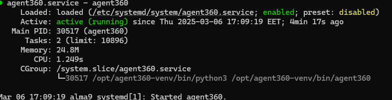
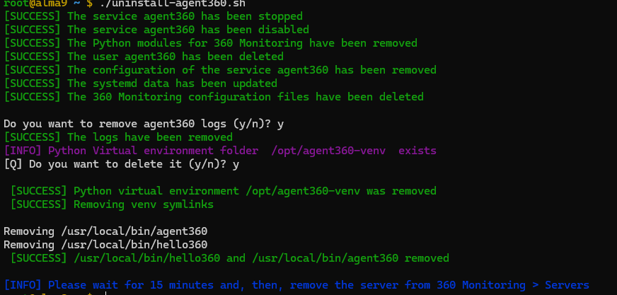

>> [!WARNING]  
>> Due to how cPanel integrates 360 monitoring plugin the script might not always work causing 404 errors. Please rever to below article
[360 monitoring plugin error 404 Error](https://support.cpanel.net/hc/en-us/articles/30814926304151-360-monitoring-plugin-error-404-Error-POST-https-api-monitoring360-io-metrics-get-metrics-data-404)

## Agent 360 script for installation of 360 monitoring
- Available usage options

```bash
./agent360.sh --help
Usage: Positional arguments for agents360.sh script.

./agent360.sh [--args| ARG..] [--args| ARG..]

--help|--h                       Displays this information

--skip-deps --skip-dep-install  Skip OS package instalation

--user-venv                     Install agent in virtual environment

--force                         Install even if agent360 is already instaled

--token <token value>           360 Monitoring account User ID:

```

- Positional argument error handling
```bash
./agent360.sh -h
[CRITICAL] Invalid Token. Please enter valid User ID

[WARNING] You can check it at 360monitoring.com -> Servers -> Add server

Direct page URL: https://app.360monitoring.com/servers/overview
```


- Installation example with token and virtual environment
```bash
./agent360.sh token --use-venv 

```


- Agent service working with venv




## Regular installation requires only a token to run.

```bash
/agent360.sh token
```

## uninstallation script works for both venv version and non-venv

```bash
./uninstall-agent360.sh
```

